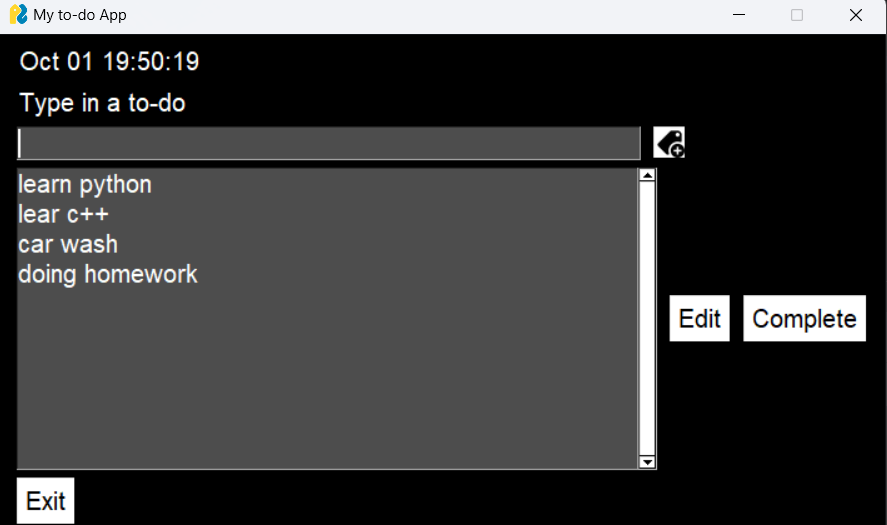

# SimpleGUI To-Do App

A simple desktop To-Do application built with Python and `PySimpleGUI`. This app provides an intuitive graphical interface for managing your daily tasks.

## Table of Contents


- [Features](#features)
- [Prerequisites](#prerequisites)
- [Usage](#usage)
- [Screenshorts](#screenshort)

## Features

- **Add To-Do**: Create and add new tasks to your to-do list.
- **Edit To-Do**: Modify existing tasks in your list.
- **Delete To-Do**: Remove completed or unnecessary tasks.
- **View To-Dos**: Display all tasks in a clear and structured list.

## Prerequisites

Before running the application, ensure you have the following installed:

- **Python 3.x**
- **PySimpleGUI** library

To install the necessary packages, run:

```bash
pip install PySimpleGUI
```

## Usage
To run the application, execute the following command:
```bash
python SimpleGui-todo-app.py
```
## screenshort



